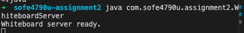
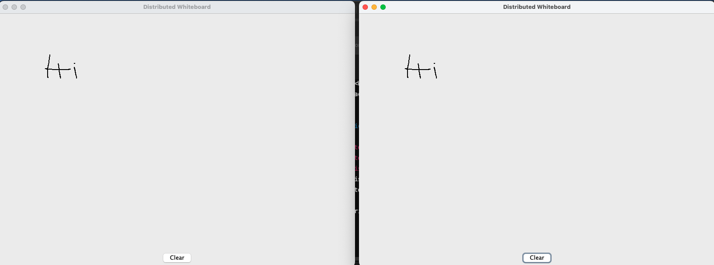

# soe4790u-assignment2

## Description

This is a distributed whiteboard application developed as part of SOFE 4790U Assignment #2. The application allows multiple clients to connect and collaboratively draw on a shared whiteboard in real-time using Java RMI. Clients can draw lines, add text, clear the canvas, and undo actions. The server manages the shared state of the whiteboard and provides these functionalities via remote methods.

## Commands

### Compiling and Running

1. Compile

```sh
javac com/sofe4790u/assignment2/*.java
```

2. Run server

```sh
java com.sofe4790u.assignment2.WhiteboardServer
```

3. Run client

```sh
java com.sofe4790u.assignment2.WhiteboardClient
```

### Clean

```sh
rm com/sofe4790u/assignment2/*.class
```

## Screenshots

### Running the server



### Running 2 Clients


